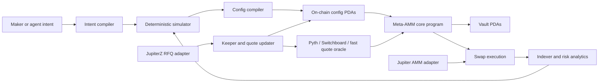

# Meta-AMM

> **Status: Work in Progress — research & architecture stage.**
> The simulator runs, the math kernel is hardening, and the on-chain program
> is init-only. **Nothing here custodies funds yet.** Treat current code as a
> reference for design decisions, not a maker you can deploy.

[](#current-status)
[](docs/roadmap/mvp-roadmap.md)
[](#current-status)
[](#development)
[](crates/meta_amm_math)
[](Anchor.toml)

---

A configurable maker kernel for Solana. Strategy lives in typed, simulated,
calibrated config off-chain; the chain executes a small set of audited curve
primitives. The maker surface is expressive — bps, slot windows, inventory
bands, quote envelopes — but every config has to clear schema validation,
bounded compilation, and simulator gates before it ever sees a vault.

The thesis, in one paragraph: makers can already glue Meteora + Phoenix +
Hadron + Jupiter together by hand. Meta-AMM is only worth shipping if its
*simulator, calibration tooling, and account-budgeted execution path* make a
good config easier to deploy than that hand-glued stack. So the wedge is the
off-chain product; the on-chain program is the enforcement surface for what
the simulator can already justify.

## What it actually is right now

| Layer | Status | Where |
|---|---|---|
| Fixed-point math (Q64.64, mul-div-floor 256/128, decimal scaling) | hardening | [`crates/meta_amm_math`](crates/meta_amm_math) |
| Reference-quote pricing (spread, aging, inventory skew, bands) | implemented | [`reference.rs`](crates/meta_amm_math/src/reference.rs) |
| Constant-product fallback | implemented | [`cpmm.rs`](crates/meta_amm_math/src/cpmm.rs) |
| Bounded config compiler + canonical decimal-scale preimage | implemented | [`crates/meta_amm_config`](crates/meta_amm_config) |
| Deterministic simulator + scenario packs + replay CSV | implemented | [`crates/meta_amm_sim`](crates/meta_amm_sim) |
| Reference-quote calibration + best-config export | implemented | [`calibration.rs`](crates/meta_amm_sim/src/calibration.rs) |
| Anchor program — `initialize_reference_quote_pool` (init-only) | implemented | [`programs/meta_amm`](programs/meta_amm) |
| Vault custody, swaps, quote updates, pause flows | **not started** | — |
| BinnedRange / PiecewiseCurve modes | **not started** | — |
| Pooled LP share algebra | **not started** | — |
| Jupiter / aggregator adapter | **not started** | — |

## The four maker modes (target design)

| Mode | When it's the right tool |
|---|---|
| `ReferenceQuote` | Externally priced assets — BTC, SOL, ETH, FX, gold, tokenized equities |
| `BinnedRange` | DLMM-style native price discovery, volatile long-tail |
| `PiecewiseCurve` | Launches and shaped curves without an on-chain interpreter |
| `ConstantProduct` | Lazy-maker fallback where safety beats precision |

Same pool lifecycle, same SDK, same aggregator manifest. Swap math is finite
enum branches — never interpreted user code.

## Architecture in one diagram



Three planes:
- **Control plane** — intent, simulation, config compilation, keepers, monitoring
- **On-chain execution plane** — pool state, vaults, curve primitives, swaps, freshness, fees, breakers
- **Integration plane** — Jupiter adapter, RFQ adapter, indexer, agent skill

## Design pillars

1. Strategy selection, simulation, and config compilation stay **off-chain**.
2. The simulator is the wedge; the on-chain program enforces what it can justify.
3. Fixed-point math is an **independent hardening project** — bigint reference, fuzzing, golden vectors before dependent APIs freeze.
4. Store only **compact, bounded, validated** config on-chain.
5. Implement a small set of **audited curve primitives** instead of a curve interpreter.
6. **Aggregator account-meta budget** is a hard constraint from the first account layout.
7. Maker-owned and pooled LP custody under one shape — **maker-owned ships first**.
8. Every config goes through typed schemas, bounds, simulation, and invariant checks before activation.
9. Score configs on **LP outcome** — fees + incentives − adverse selection − update cost − priority fees − opportunity cost − IL/LVR.
10. Anchor for the first core program; Pinocchio/`no_std` only for measured hot-path bottlenecks.

## Current Status

The current Anchor program exposes one instruction: `initialize_reference_quote_pool`.
It creates a deterministic pool-config PDA for an `(authority, base_mint, quote_mint)`
tuple, validates ReferenceQuote parameters through the shared bounded compiler,
and stores fixed-size config-layout bytes in the Anchor account. The mints and
their token programs are now verified at init (Token / Token-2022) and decimals
are read from the mint accounts — not user args — so the canonical
`decimal_scale_preimage` is committed from on-chain truth.

It is **intentionally init-only.** Token vault custody, quote-state updates, and
swap execution are separate slices so account budgets and trust boundaries stay
explicit.

The simulator is a deterministic multi-path smoke run for CPMM and ReferenceQuote.
ReferenceQuote models quote landing latency, seeded update drops, same-slot
update/swap ordering, stale/protected rejects, and max quote age. Multi-path
summaries report **min / p05 / mean / p50 / p95 / max** so tails are visible.
Scenario packs emit **pass / warn / block** safety gates for fill rate, stale and
protected rejects, update drops, quote age, and inventory drift. Calibration
ranks candidates by safety-gate severity first, then fill-tail and rough maker
score, and exports the winner as a deterministic ReferenceQuote config handoff
with assumptions and gate findings attached.

## Workspace Layout

```text
Cargo.toml
crates/
  meta_amm_config/     # bounded config compiler + canonical layout
  meta_amm_math/       # Q64.64, decimal scaling, ReferenceQuote, CPMM
  meta_amm_sim/        # deterministic simulator + scenario packs + calibration
programs/
  meta_amm/            # Anchor program (init-only)
docs/
  architecture/        # iteration log, selected design, slice review
  research/            # reference review (DLMM, DBC, Hadron, Jupiter, oracles)
  roadmap/             # phased MVP plan
tests/
  fixtures/            # replay CSVs
  golden/              # canonical preimage, reference-quote export fixture
```

## Development

```sh
cargo fmt --check
cargo clippy --all-targets -- -D warnings
cargo test
anchor build

cargo run -p meta_amm_sim --quiet
cargo run -p meta_amm_sim --quiet -- --scenario-pack
cargo run -p meta_amm_sim --quiet -- --calibrate-reference
cargo run -p meta_amm_sim --quiet -- --calibrate-reference --export-best-config
cargo run -p meta_amm_sim --quiet -- --replay-csv tests/fixtures/reference-replay.csv
```

Replay CSV schema:

```text
slot,fair_price,side,amount_in,quote_landing_slot
```

`side` and `amount_in` are optional per row. `quote_landing_slot` is optional;
use an integer landing slot for landed updates or `drop` for failed updates.

## Documents

- [Research synthesis](docs/research/reference-review.md) — DLMM, DBC, Hadron, Jupiter, oracle landscape
- [Architecture iteration log](docs/architecture/iteration-log.md) — what was tried and rejected
- [Selected architecture](docs/architecture/architecture.md) — current design
- [Implementation-slice review](docs/architecture/implementation-slice-review.md) — corrections from the first slice
- [MVP roadmap](docs/roadmap/mvp-roadmap.md) — phased delivery plan

## What I will *not* claim yet

- That this is a maker edge. The simulator is plumbing; calibration is a
  smoke-test wedge — not a backtest of edge against real flow.
- That ReferenceQuote stale-rejection is an LVR defense. It is a switch-off,
  not a price.
- That pooled LP accounting is additive. Share algebra and withdrawal queues
  are unspecified and **not** safe to assume.
- That fixed-point math is "done." It needs bigint reference parity, fuzzing,
  and cross-language golden vectors before any custody slice depends on it.

## License

TBD.
