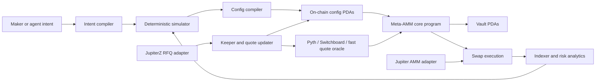

<div align="center">

# Meta-AMM

**A configurable maker kernel for Solana — typed config off-chain, audited primitives on-chain.**

[](#status)
[](#devnet)
[](crates/meta_amm_math)
[](Anchor.toml)
[](#license)

[Architecture](docs/architecture/architecture.md) ·
[Roadmap](docs/roadmap/mvp-roadmap.md) ·
[Research](docs/research/reference-review.md) ·
[Surfpool spec](docs/testing/surfpool-spec.md)

</div>

---

> **Work in progress, devnet only.**
> The on-chain program now ships maker-owned custody, signed quote updates,
> a single `ReferenceQuote` swap mode, and an authority-gated pause.
> Token-2022 transfer-fee mints are rejected; the broader extension whitelist
> is still tightening. Do not put real funds against this on mainnet.

## What it is

A maker expresses their strategy as **typed, bounded config**. The simulator
**validates and calibrates** it. The on-chain program enforces only what the
simulator can already justify — no curve interpreter, no admin escape
hatches, no surprises in the swap path.

The wedge is the off-chain product. The on-chain kernel is the smallest
enforcement surface that lets a calibrated config become real liquidity.

## Status

| Layer | State |
| --- | --- |
| Q64.64 fixed-point math (`mul_div_floor` 256/128, decimal scaling) | hardening |
| `ReferenceQuote` pricing — spread, aging, inventory skew, hard band | implemented |
| Constant-product fallback math | implemented |
| Bounded config compiler + canonical decimal-scale preimage | implemented |
| Deterministic simulator + scenario packs + replay CSV | implemented |
| Calibration + best-config export | implemented |
| Anchor program — pool / quote / vault init, fund, pause, swap | implemented (devnet) |
| Token-2022 extension whitelist | partial — only transfer-fee rejected |
| `BinnedRange` / `PiecewiseCurve` modes | not started |
| Pooled LP share algebra + withdrawal queues | not started |
| Aggregator adapters (Jupiter, RFQ) | not started |

## Devnet

```text
program             CzVBvCUvx8RWEsiRybEAtr6TwydEn9WByXG7WTezGsq1
upgrade authority   5n1YDbnuU84hH6Vs5JsLeQEXrwGJ6UMadLwcbdfpQLpr
IDL                 initialized on devnet
```

## Architecture



Three planes:

- **Control plane** — intent, simulation, config compilation, keepers, monitoring
- **On-chain execution plane** — pool state, vaults, curve primitives, swaps, freshness, fees, breakers
- **Integration plane** — Jupiter adapter, RFQ adapter, indexer, agent skill

## Maker modes (target design)

| Mode | When it's the right tool |
| --- | --- |
| `ReferenceQuote` | externally priced — BTC, SOL, ETH, FX, gold, tokenized equities |
| `BinnedRange` | DLMM-style native price discovery, volatile long-tail |
| `PiecewiseCurve` | launches and shaped curves without an on-chain interpreter |
| `ConstantProduct` | lazy-maker fallback where safety beats precision |

Same pool lifecycle, same SDK, same aggregator manifest. Swap math is finite
enum branches — never interpreted user code.

## On-chain instructions (today)

| Instruction | Caller | What it does |
| --- | --- | --- |
| `initialize_reference_quote_pool` | authority | Create the pool config PDA from typed args. Mints and token programs are bound and decimals are read from the mint accounts. |
| `initialize_reference_quote_state` | authority | Bind a quote authority and same-slot ordering metadata to the pool. |
| `update_reference_quote` | quote signer | Publish a new mid-price. Monotonic sequence, non-backdated publish slot, no-future publish slot. |
| `pause_pool` | authority | Stop swaps. Quote refreshes and maker funding still work. |
| `initialize_maker_vaults` | authority | Create deterministic PDA-owned base/quote token vaults. |
| `fund_pool` | authority | Move authority-owned tokens into the vaults via `transfer_checked`. |
| `swap_exact_in` | taker | Swap against the active quote with slippage and exact quote-sequence binding. |

## Quick start

```sh
# build & test
cargo fmt --check
cargo clippy --all-targets -- -D warnings
cargo test
anchor build

# simulator
cargo run -p meta_amm_sim --quiet
cargo run -p meta_amm_sim --quiet -- --scenario-pack
cargo run -p meta_amm_sim --quiet -- --calibrate-reference --export-best-config
cargo run -p meta_amm_sim --quiet -- --replay-csv tests/fixtures/reference-replay.csv

# Surfpool mainnet-fork harness
pnpm install --frozen-lockfile
pnpm typecheck:surfpool
pnpm surfpool:smoke
```

Replay CSV schema:

```text
slot,fair_price,side,amount_in,quote_landing_slot
```

`side` and `amount_in` are optional per row. `quote_landing_slot` is optional;
use an integer for landed updates or `drop` for failed updates.

## Design pillars

1. Strategy selection, simulation, and config compilation stay **off-chain**.
2. The simulator is the wedge; the on-chain program enforces what it justifies.
3. Fixed-point math is an **independent hardening project** — bigint reference,
   fuzzing, golden vectors before dependent APIs freeze.
4. Store only **compact, bounded, validated** config on-chain.
5. Implement a small set of **audited curve primitives** instead of a curve interpreter.
6. **Aggregator account-meta budget** is a hard constraint from the first account layout.
7. Maker-owned and pooled LP custody under one shape — **maker-owned ships first**.
8. Every config goes through typed schemas, bounds, simulation, and invariant checks before activation.
9. Score configs on **LP outcome** — fees + incentives − adverse selection − update cost − priority fees − opportunity cost − IL/LVR.
10. Anchor for the first core program; `Pinocchio` / `no_std` only for measured hot-path bottlenecks.

## Documents

| Document | Why read it |
| --- | --- |
| [Selected architecture](docs/architecture/architecture.md) | The current design, end to end. |
| [Architecture iteration log](docs/architecture/iteration-log.md) | What was tried and rejected. |
| [Implementation-slice review](docs/architecture/implementation-slice-review.md) | Corrections from the first slice. |
| [Research synthesis](docs/research/reference-review.md) | DLMM, DBC, Hadron, Jupiter, oracle landscape. |
| [MVP roadmap](docs/roadmap/mvp-roadmap.md) | Phased delivery plan. |
| [Surfpool spec](docs/testing/surfpool-spec.md) | Mainnet-fork test invariants for the deployed surface. |

## What this does *not* claim yet

- That it is a maker edge. The simulator is plumbing; calibration is a
  smoke-test wedge — not a backtest of edge against real flow.
- That `ReferenceQuote` stale-rejection is an LVR defense. It is a switch-off,
  not a price.
- That pooled LP accounting is additive. Share algebra and withdrawal queues
  are unspecified and **not** safe to assume.
- That fixed-point math is "done." It needs bigint reference parity, fuzzing,
  and cross-language golden vectors before any custody slice depends on it.
- That Token-2022 is fully supported. Only transfer-fee mints are rejected
  today; permanent-delegate, transfer-hook, and confidential-transfer mints
  are not safe against this program yet.

## Workspace

```text
crates/
  meta_amm_math/    Q64.64, decimal scaling, ReferenceQuote, CPMM
  meta_amm_config/  bounded config compiler + canonical layout
  meta_amm_sim/     deterministic simulator + scenario packs + calibration
programs/
  meta_amm/         Anchor program
docs/
  architecture/     iteration log, selected design, slice review
  research/         reference review (DLMM, DBC, Hadron, Jupiter, oracles)
  roadmap/          phased MVP plan
  testing/          Surfpool mainnet-fork test spec
tests/
  fixtures/         replay CSVs
  golden/           canonical preimage, reference-quote export fixture
```

## License

TBD.
