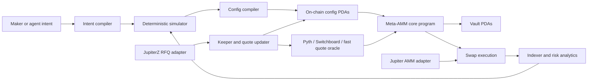

# Meta-AMM Architecture

## Thesis

Meta-AMM should be a configurable maker kernel, not a generic strategy runtime.
Agents and makers should get a highly expressive design surface, but the chain
should execute only a small set of audited, bounded primitives. Expressiveness
belongs in typed config, simulation, and compilation; swap execution stays
finite and measurable.

The architecture has three planes:

- Control plane: intent, simulation, config compilation, keepers, routing
  integration, monitoring.
- On-chain execution plane: pool state, vaults, curve primitives, swaps,
  oracle/freshness checks, fees, circuit breakers.
- Integration plane: Jupiter AMM adapter, JupiterZ/RFQ adapter, other DEX
  aggregator adapters, indexer, analytics, agent skill.

The wedge is not "one more AMM program." A maker can already combine Hadron,
Meteora, Raydium, Phoenix, and Jupiter routing directly. Meta-AMM is only
strictly better if its simulator, calibration tooling, typed risk surface, and
account-budgeted execution make it easier to deploy a good strategy than
hand-composing venues. The on-chain kernel is the enforcement surface for
configs the simulator can justify; it is not the primary moat by itself.

## Selected Core Design

The core program exposes four maker modes under one pool lifecycle:

1. `ReferenceQuote`
   - For assets with external reference prices.
   - Uses mid-price, base spread, bid curve, ask curve, inventory curve, quote
     TTL, and oracle/sequence checks.
   - Best for BTC, SOL, ETH, gold, FX, tokenized equities, and other assets with
     credible external fair value.

2. `BinnedRange`
   - DLMM-like discrete bin liquidity.
   - Uses active bin, bin step, bin arrays, range positions, dynamic fees, and
     rebalance planning.
   - Best for native-discovery markets and volatile long-tail assets.

3. `PiecewiseCurve`
   - DBC-inspired bounded `(sqrt_price, liquidity)` segments.
   - Supports shaped launch/custom curves without arbitrary on-chain code.
   - Best for launches, shaped price discovery, or custom inventory ramps.

4. `ConstantProduct`
   - Minimal `x * y = k` fallback.
   - Best for lazy makers and long-tail bootstrapping where safety beats
     precision.

These modes share one account model and one integration SDK where possible, but
their swap math is implemented as finite enum branches, not interpreted user
code.

The architecture is generic across the target use cases:

- reference-priced markets such as BTC, ETH, SOL, FX, gold, equities, or
  tokenized real-world assets
- native-discovery markets such as memecoins and long-tail assets
- passive configurable LP positions and constant-product replacements
- agent-managed market making with explicit risk budgets
- time-bound liquidity campaigns where incentives, retention, and depth cliffs
  are part of the strategy

Implementation can ship these one by one, but the account model, simulator,
SDK, and aggregator adapter should be designed around the full set.

## Implementation-Slice Corrections

The first working slice changed several architectural assumptions:

- Fixed-point math is a standalone hardening workstream. Do not treat the math
  crate as a thin reusable utility until it has property tests against a bigint
  reference implementation, fuzzing, golden vectors, and cross-language
  serialization tests.
- ReferenceQuote stale rejection is a switch-off mechanism, not a complete
  LVR defense. The architecture must price or route around quote aging before a
  pool reaches hard rejection.
- Inventory skew calibration is a hard per-asset problem. A default bps slope
  is not enough; the compiler needs risk-aversion, volatility, hedge horizon,
  and hard inventory-band inputs.
- Swap account count is a hard budget. The hot swap path should merge fee and
  risk fields into `PoolConfig` unless a field is genuinely cold/admin-only.
- Pooled LP custody is not proven additive. The maker-owned path can ship first,
  but the pooled LP path needs share algebra and withdrawal queues before the
  state layout is considered final.

## Current Build Snapshot

The live repo now implements a maker-owned ReferenceQuote path with:

- deterministic pool config, quote state, maker vault state, and token vault
  PDAs
- exact-in swaps bound to an expected quote sequence and minimum output
- Token-2022 support for exact-transfer mints, with transfer-fee mints rejected
- authority pause for swaps
- quote-age behavior spanning fresh, aging, protected, expired, and paused
  states
- swap analytics emitted as `ReferenceSwapEvent`
- `update_reference_quote_v2` for atomic midprice plus base-spread updates
- `CurveSlotState` for staged and monotonic curve activation
- config and TypeScript SDK aggregator manifests for the ReferenceQuote swap
  account contract
- TypeScript cached-state quoting parity tests for the ReferenceQuote path
- bounded Piecewise/Prop curve math and simulator post-fill policies

The staged curve state is intentionally not wired into `swap_exact_in` yet. It
is an activation boundary for future `BinnedRange` and `PiecewiseCurve` modes,
not an interpreted curve runtime.

## System Diagram



## On-Chain Components

### `PoolConfig` PDA

One per maker/pair/mode.

Fields:

- pool id and version
- maker authority
- mode enum
- base mint, quote mint, token programs
- base decimals, quote decimals, decimal scale hash
- vault addresses
- embedded hot fee config
- embedded hot risk config
- optional cold policy config address
- oracle config address
- curve book address
- paused flag
- config sequence
- bump

Invariant:

- Token decimals and mint/program ids are immutable after initialization.
- Decimal scale is derived and stored by the program, not supplied only by the
  client.
- Mode can only change through a migration flow that closes/reopens or creates a
  new pool version.
- Fee and risk fields required by `swap_exact_in` live in `PoolConfig` to save
  account metas. Cold policy can be split out only when it is not read by the
  swap path.

### `VaultState` PDA

Tracks owned liquidity.

Custody models:

- `MakerOwned`: one maker authority owns the capital and receives maker PnL.
- `PooledLP`: third-party LPs deposit into a share-accounted vault governed by
  pool policy.

Implementation order:

- Ship `MakerOwned` first because it has fewer accounting invariants and is the
  right proof surface for reference-quote and constant-product modes.
- Define the custody enum and simulator hooks from the beginning, but do not
  assume `PooledLP` is additive. Maker-owned state may need a versioned rewrite
  if pooled share accounting proves incompatible.
- Add pooled vault shares, deposit/withdraw queues, withdrawal locks, per-LP
  accounting, and stale-period semantics only after the maker-owned swap path is
  measured and stable.

Invariant:

- Vault token balances must cover pool accounting.
- Maker withdrawals cannot bypass unsettled obligations.
- LP share supply must equal claimable vault equity after pending fees,
  withdrawals, and protocol obligations when pooled custody is enabled.

Pooled LP design gate:

- Specify share minting algebra before implementation. For CPMM-like pools this
  can be reserve-ratio based; for reference-priced pools it likely needs
  oracle-valued NAV in quote atoms plus conservative stale-price handling.
- Use per-LP position accounts and queued withdrawals. Do not make every LP
  deposit/withdraw contend on one hot account during volatile windows.
- Define withdrawal request, valuation snapshot, cooldown, settlement, and
  emergency modes before exposing third-party deposits.

### `OracleConfig` PDA

Fields:

- provider enum: Pyth, Switchboard, maker-signed fast oracle, custom adapter
- oracle policy: public only, maker-signed only, or public plus maker-signed
- feed id or quote account id
- expected owner/program id
- max age
- max confidence bps
- quote TTL slots
- min update sequence
- max signed-quote deviation from public reference
- fallback behavior

Invariant:

- A swap in reference mode fails if the reference price or maker quote is stale.
- Price, confidence, exponent, and decimal scaling are checked before use.
- Sequence must be monotonic for maker-signed quote updates.
- When both public and maker-signed feeds are required, the signed quote must
  stay inside the configured deviation envelope from the public reference.

### `CurveBook` PDA

Stores compact mode-specific curve state.

For `ReferenceQuote`:

- bid curve points
- ask curve points
- inventory curve points
- interpolation enum per segment
- max notional per quote side
- max price deviation from reference

For `BinnedRange`:

- active bin id
- bin step
- bin array bitmap or chunk metadata
- dynamic fee parameters

For `PiecewiseCurve`:

- bounded sqrt-price/liquidity points
- current segment index
- max segment count

For `ConstantProduct`:

- no extra curve state beyond vault reserves and fee config

Invariant:

- Curve arrays are bounded.
- Curve points are monotonic where required.
- Liquidity/depth is positive where a segment is active.
- Price factors and spreads stay within configured caps.

### Hot Fee Fields

Fields embedded in `PoolConfig` for the swap path:

- base fee bps
- dynamic fee mode
- maker fee recipient
- protocol fee recipient
- referral/host fee recipient
- max fee cap

Invariant:

- Total fee cannot exceed max fee cap.
- Fee splits sum to the collected fee.
- Dynamic fees are deterministic from on-chain state.

### Hot Risk Fields

Fields embedded in `PoolConfig` for the swap path:

- max trade size
- max notional per slot/window
- max inventory imbalance
- max reference-price deviation
- stale quote behavior
- volatility circuit breaker
- allowed routers/programs
- blocked accounts/programs
- flow spread adjustments
- minimum liquidity floor
- max withdrawal rate for pooled LP custody
- post-campaign retention window
- update-cost budget

Invariant:

- Risk checks execute before token transfers.
- Circuit breakers can only tighten risk or pause, not extract funds.
- Flow policies are disclosed in config and reflected in quotes.
- Pooled LP withdrawals cannot violate active minimum liquidity floors unless
  the pool is in an explicit emergency state.
- Update-cost budgets are advisory in maker-owned mode and enforceable as
  campaign or vault policy in pooled LP mode.

Cold fee/risk policy:

- Optional cold policy accounts may hold admin metadata, historical limits,
  campaign settings, blocked-account sets, or governance-controlled defaults.
- A cold policy account must not be required for the normal aggregator swap path
  unless account budget is re-measured and still has headroom.

## Swap Account Budget

The implementation slice measured 12-14 accounts for a single swap after token
vaults, user token accounts, oracle source, token programs, router/referral, and
the program id are included. That leaves little room inside Solana transaction
limits for referral accounts, flow-policy accounts, or Pyth push updates.

Budget rules:

- Treat account metas like CU: every swap feature must spend from a fixed
  budget and report the new account count.
- Target at most 12 accounts for the public exact-in aggregator path.
- Allow 14 accounts only for explicitly documented advanced paths.
- Do not require a Pyth push update inside the swap transaction.
- Merge `FeeConfig` and `RiskConfig` into `PoolConfig` for hot fields.
- Keep exact-out, referral, RFQ, pooled LP, and flow-policy paths separately
  budgeted; they should not silently bloat the base exact-in path.

## Instructions

Protocol instruction surface:

- `initialize_pool`
- `fund_pool`
- `withdraw_pool`
- `set_fee_config`
- `set_risk_config`
- `set_oracle_config`
- `set_reference_curve`
- `set_binned_range_config`
- `set_piecewise_curve`
- `update_fast_quote`
- `swap_exact_in`
- `swap_exact_out`
- `pause_pool`
- `close_pool`

The MVP implements only the subset required by the selected first mode. Mode
specific config instructions can exist in the interface plan before they are
enabled on-chain.

Keep instruction data compact. Large configs should be written in chunks, then
activated atomically by hash/sequence.

Pooled LP instruction set, introduced after maker-owned custody is stable:

- `initialize_lp_vault`
- `deposit_lp`
- `request_withdraw_lp`
- `process_withdraw_lp`
- `settle_lp_fees`
- `set_lp_policy`

These should reuse the same pricing math where possible, but pooled custody is
allowed to add accounting hooks to the swap path. Do not assume pooled LP is a
pure vault-layer extension until share accounting proves it.

## ReferenceQuote Operating Envelope

ReferenceQuote works only when maker update speed, landing latency, and market
volatility keep the quote inside a profitable operating envelope. A hard TTL is
necessary, but it is not enough: it turns the pool off when conditions exceed
the envelope.

Quote age states:

- `Fresh`: normal quote, normal spread and size limits.
- `Aging`: quote still valid, but spread surcharge and size decay increase as a
  function of quote age, volatility estimate, and update-latency estimate.
- `Protected`: public AMM path is restricted to small size or one side; larger
  flow should move to RFQ/last-look or be rejected.
- `Expired`: public AMM swap rejects.
- `Paused`: keeper or circuit breaker disables the pool until a fresh quote and
  risk check restore it.

Design requirements:

- Simulate quote-age surcharge, size decay, stale rejection, and RFQ fallback
  separately. Do not report a stale-rejecting pool as simply "profitable."
- Measure fill rate alongside LP outcome. A pool that wins by rejecting most
  flow may be a risk-control product, not a market-quality product.
- Treat landing latency and failed quote updates as stochastic inputs, not
  constants.
- Allow calm-market ReferenceQuote as a valid product posture, but document that
  volatile markets need a different defense than stale rejection alone.

## Inventory Calibration

Inventory skew is not a maker-chosen bps knob. It must be derived or calibrated.

Required calibration inputs:

- target inventory and hard inventory bands
- asset volatility estimate and confidence interval
- maker risk aversion
- inventory horizon
- hedge venue availability and cost
- expected flow imbalance
- max acceptable drawdown and stale quote loss

Rules:

- `max_inventory_imbalance` is a hard risk band, not a substitute for skew
  slope.
- Linear skew is allowed only if simulator results show it corrects inventory
  before hard bands are hit.
- Nonlinear skew, one-sided blocking, or external hedging should be supported
  for assets where linear skew is too weak.
- Defaults must be asset-class presets produced by calibration, not protocol
  constants.

## Quote Update Ordering

`config_sequence` and signed quote sequence prevent replay, but they do not
guarantee that a maker's `update_fast_quote` lands before a router swap in the
same slot. Solana serializes transactions at execution time; if a swap executes
first, it can consume the previous still-valid quote.

Design requirements:

- Quote responses must include the quote sequence, quote publish slot, and
  max executable slot used by the router.
- Swap instructions should carry the quoted sequence and max quote age used
  during routing. The program must reject if current state is older than the
  router's quoted state or outside the quoted age envelope.
- Simulators must model update/swap ordering races, failed updates, and landing
  latency variance.
- Makers who cannot tolerate old-quote fills during volatile windows should use
  `Protected`, `Expired`, RFQ/last-look, or pause states; public AMM execution
  cannot promise maker update priority.

## Off-Chain Components

### Maker Intent Schema

Agents interact with `MakerIntent`, not raw accounts.

Example fields:

- asset pair
- asset model: external reference, native discovery, hybrid
- objective: spread capture, inventory neutral, directional inventory, launch
  discovery, passive fallback
- capital
- risk profile
- target inventory ratio
- max directional exposure
- max drawdown
- max stale quote loss
- preferred oracle
- oracle policy: public only, maker-signed only, or public plus maker-signed
- rebalance cadence
- venue integration target
- custody model: maker-owned or pooled LP
- optional liquidity campaign: incentive window, decay schedule, reward formula,
  target depth, and retention objective

The compiler maps this to `StrategyConfig`.

### Strategy Compiler

Responsibilities:

- select mode
- normalize decimals
- choose oracle policy
- choose curve primitive
- compile bid/ask/range/segment arrays
- compute expected account footprint
- estimate CU and transaction size
- estimate aggregator account footprint
- emit an aggregator compatibility manifest
- score LP outcome, not raw TVL or headline depth
- model incentive windows and post-window retention risk
- produce a simulation manifest
- refuse unsafe configs before they reach signing

The compiler is deterministic and versioned. Agent suggestions are advisory;
the compiler is the authority.

### Math Kernel

The math kernel is a first-class project.

Requirements before dependent API freeze:

- fixed-point operations compared against a bigint reference implementation
- property tests over random prices, decimals, reserves, and trade sizes
- fuzzing for overflow, rounding, and monotonicity
- golden vectors shared by Rust, TypeScript, simulator, and on-chain tests
- explicit rounding policy per operation
- benchmark thresholds for router quote latency

The program should prefer battle-tested wide-integer crates where licensing,
`no_std`, and Solana constraints allow. Hand-written 256-bit arithmetic needs a
specific justification and heavier verification.

### Simulator

The simulator is required before funding.

It must report:

- expected fee capture
- incentives earned
- inventory drift
- adverse-selection markout
- LVR/stale-price loss estimate
- slippage and fill quality
- price-path PnL distribution
- worst-case drawdown
- quote staleness sensitivity
- rebalance cost
- priority-fee and landing assumptions
- update transaction costs and failed-update rate
- liquidity response and retention estimates for campaigns

Implementation rule:

- Reuse the same Rust math crate for on-chain tests and off-chain simulation
  only after the math kernel passes its hardening gate.
- Keep Monte Carlo, historical replay, and SVM/fork simulation as separate
  layers.
- Never let the conversational agent be the source of truth for numbers.
- Never present a single-path simulation as expected maker edge. Every report
  must identify scenario assumptions, sample size, flow model, landing model,
  and confidence interval.

### Keepers and Quote Updaters

Reference mode needs fast updates.

Responsibilities:

- fetch Pyth/Switchboard/custom reference data
- compute maker mid/spread/curve updates
- sign and submit `update_fast_quote`
- set measured CU limits and priority fees
- retry idempotent updates
- pause pools when stale or outside risk bounds
- monitor campaign start/end and decay schedules
- throttle or pause pooled LP exits when configured depth floors would be broken

### Aggregator Adapters

Aggregator compatibility is a design constraint from the first public account
layout. The project should optimize for Jupiter first because it is the dominant
Solana routing interface, while keeping the adapter layer DEX-aggregator
neutral.

Jupiter AMM adapter:

- implements the Jupiter AMM interface
- performs no network calls inside quote/update
- uses cached account data
- exposes reserve mints, update accounts, quote, and swap metas
- treats exact-in as required before exact-out
- rejects pool configs that cannot be represented from cached account state
- records route-plan attribution for analytics so composite routed quality is
  not confused with standalone pool quality

JupiterZ/RFQ adapter:

- optional for market makers who want RFQ flow
- quote/swap/tokens webhook
- target response time below 250ms
- separate fill-rate monitoring

DFlow/Titan/other aggregators:

- treat as later distribution integrations once the aggregator-neutral adapter
  interface, Jupiter adapter, and direct SDK are stable.

## Decimal Safety

Decimal safety is a first-order invariant:

- store mint decimals at initialization
- derive a `price_scale` from base/quote decimals
- store prices in explicit fixed-point formats
- define a canonical binary preimage for `decimal_scale_hash`
- reject config that omits scale metadata
- reject swaps if token accounts do not match the stored mint/program ids
- expose all UI/agent prices as decimal strings plus atom amounts

No config should rely on "6 vs 9 decimals" being remembered by an agent.

Canonical hash:

```text
sha256(
  "meta-amm:decimal-scale:v1" ||
  base_mint[32] ||
  quote_mint[32] ||
  base_token_program[32] ||
  quote_token_program[32] ||
  base_decimals:u8 ||
  quote_decimals:u8 ||
  price_domain:u8
)
```

`price_domain` is `0` for raw quote-atoms per raw base-atom. Any future human
decimal or oracle-normalized domain must use a new domain byte and versioned
test vectors. The Rust and TypeScript SDKs must share golden vectors for this
preimage.

## Trust Boundaries

Trusted on-chain:

- vault custody
- swap accounting
- fee accounting
- oracle freshness checks
- risk/circuit-breaker enforcement
- monotonic config activation

Trusted off-chain:

- strategy research
- config recommendation
- simulation
- transaction planning
- keeper submission
- indexer analytics
- campaign and retention analysis

External dependencies:

- oracle providers
- DEX aggregators
- RPC and landing services
- auditors and build-verification tooling

## Verification Strategy

Minimum lanes before public devnet:

- unit tests for every math primitive
- bigint-reference property tests for fixed-point math
- fuzz tests for fixed-point overflow and rounding
- Anchor/LiteSVM tests for instruction state transitions
- property/fuzz tests for curve monotonicity, fee conservation, decimal scaling,
  and overflow
- QED-style invariant spec for pool/vault/fee/oracle state
- transaction-size and CU measurement tests
- SVM/fork simulations for representative swaps
- deterministic simulator golden tests against on-chain math
- Jupiter adapter quote tests with account fixtures
- quote-update ordering simulations
- account-budget regression tests for every swap variant

Core invariants:

- vault conservation
- fee conservation
- no stale reference quote execution
- no negative or overflowing reserves
- monotonic config version activation
- curve price monotonicity where required
- decimal scaling correctness
- canonical decimal hash equality across Rust and TypeScript
- max trade/risk caps enforced before transfer
- LP share accounting once pooled vaults are introduced
- aggregator quotes match on-chain execution for cached account fixtures
- campaign reward accounting does not pay raw TVL that disappears before the
  required uptime or time-in-range window
- pooled LP exits respect configured queues, locks, and depth floors

## Build Posture

Start with Anchor for the core program because it is faster to build, easier to
test, and fits the first invariant work. Do not begin with Pinocchio for the
whole program.

Use Pinocchio/no_std only for a measured hot path:

- maker-signed quote oracle
- reference-price update program
- possibly a minimal swap path after benchmarks prove Anchor overhead dominates

This avoids premature optimization while preserving a path to prop-MM-grade
latency.

## Final Architecture Decision

Build the architecture as a generic public protocol that supports:

- all four maker modes: `ReferenceQuote`, `BinnedRange`, `PiecewiseCurve`, and
  `ConstantProduct`
- both custody models: `MakerOwned` and `PooledLP`
- both reference mechanisms: public oracle feeds and maker-signed fast quotes
- DEX aggregator routing, with Jupiter first and an adapter-neutral boundary

Ship it in this order:

1. Math kernel hardening and canonical serialization.
2. Simulator/calibration product for one selected wedge mode.
3. Account-budgeted `MakerOwned` custody with the selected first mode.
4. Jupiter AMM adapter against cached account fixtures.
5. Second mode only after the simulator has a calibration story for it.
6. Pooled LP custody only after share algebra and withdrawal queues are
   specified and tested.
7. Liquidity campaign policy, retention analytics, and pooled-exit safeguards.
8. RFQ and additional aggregator integrations.

This preserves the generic long-term architecture while keeping each release
small enough to verify. The long-term kernel remains multi-mode, but the MVP
must prove one mode plus the simulator/calibration wedge before expanding.
